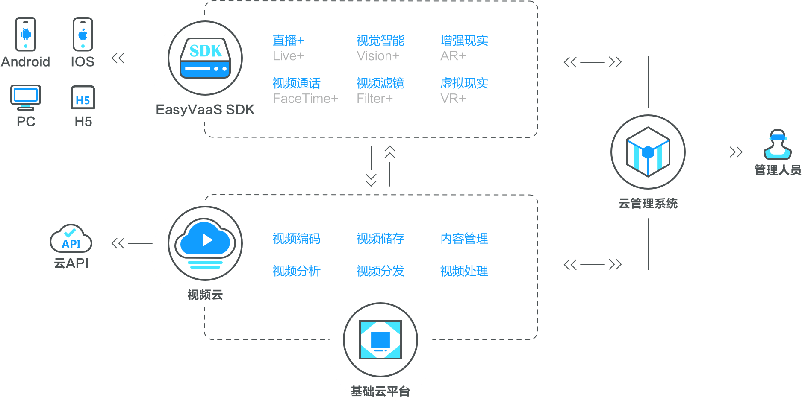

# 易视云产品简介
EasyVaaS是全球领先的视频技术和解决方案提供商, 我们提供“一站式专业服务”。从建设视频基础设施到定制媒体互动的应用程序, 从媒体发布, 存储, 网络加速等传统功能，到VR、AR等新兴技术方案。EasyVaaS SDK是可以无缝连接Android, iOS, PC, H5等多种终端。EasyVaaS SDK适用在线教育, 秀场, 活动, 电子竞技, 电子游戏, 远程医疗, 在线购物等多种应用场景。
## 客户端
提供稳定可靠的推流端SDK、播放器SDK、消息交互SDK，覆盖iOS、Android、PC、Web等各大平台。客户只需要将SDK嵌入到应用中即可快速实现视频直播、实时交互等功能。
## 服务端
* 支持千万级大规模并发观看，多条CDN线路覆盖，确保大型直播活动的稳定性。
* 可扩展存储架构，PB级海量存储，跨地域灾备，确保客户数据安全性。
* 提供大规模并发的实时互动消息系统，实时互动无延迟。

## 申请试用
点击此链接[申请试用](http://www.easyvaas.com/sdk-live.html)

## 产品架构
易视云视频直播类产品基本架构如下所示：

主要分为三部分：

* EasyVaas SDK
    * Android、iOS、PC端采集推流
    * Android、ios、PC、H5端拉流播放
    * 消息交互
    * 视频通话（连麦）
    * VR
* 视频云平台
    * 视频存储
    * 视频分发
    * 内容管理
* 云管理系统
    * 用户管理系统

