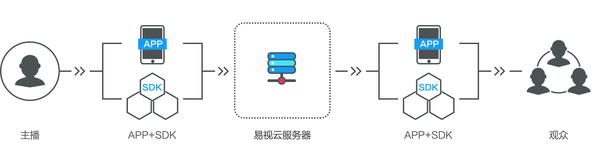
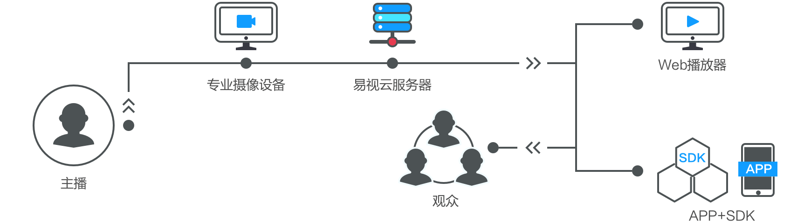

# 应用场景
## 游戏直播
全终端游戏直播，解除游戏设备的束缚。无论是电脑游戏，还是手机游戏、亦或是VR/AR游戏，通过游戏直播方案，可以快速达到直播目标为客户提供清晰流畅的游戏直播云解决方案
### 方案优势
* 	游戏终端无障碍。支持电脑游戏、手机游戏、VR/AR游戏直播，实现全终端游戏直播
* 低延迟高质量图像.普通的家庭带宽，实现高清视频直播，全平台秒级延迟，视频播放秒开，更好的用户体验
* 百万级别并发能力
* 多重数据链路备份

### 解决方案基本架构

 
## 娱乐直播
深度简化产品使用方式，协助客户解决非业务核心问题。包含视频拍摄、数据传输、平台分发、网络推广等方面的一体化解决方案，让客户不在受非核心业务影响
### 方案优势
* 全场景直播方式。提供包含拍摄设备、水下直播设备、航拍直播设备、VR全景设备等不同目标的拍摄和直播设备，实现真正的直播无死角。
* 多环境传输方法。不仅可以满足普通环境下的无线直播，而且可以满足移动模式下的专业高清直播需求，同时提供人员密集的多卡4G直播。
* 丰富的互动内容。提供包含红包、打赏、礼物、聊天、表情、美颜、连线等多种交互方式，吸引用户参与其中。
* 	低延迟高质量图像。普通的家庭带宽，实现高清视频直播，全平台秒级延迟，视频播放秒开，更好的用户体验
*  百万级别并发能力
*  多重数据链路备份

### 解决方案基本架构

## 电商直播
快速构建直播卖场，一键分享商品商场。融合直播、支付、电商、物流等各环节，简易的操作让商家快速达到销售目标

### 方案优势
* 丰富的直播方式。智能手机、个人电脑、普通摄像头、专业摄像机，商家可以根据实际场景选择直播方式。
* 	低延迟高质量图像。普通的家庭带宽，实现高清视频直播，全平台秒级延迟，视频播放秒开，更好的用户体验
*  百万级别并发能力
*  多重数据链路备份

### 解决方案基本架构

## 教育直播
多人连线，万人参与，快速搭建网络课堂。不仅支持多人视频连线，而且提供白板功能、视频文档同步、桌面共享等教育培训功能。
### 方案优势
* 支持多路视频互动。通过连线技术，可以支持多路语音和视频互动。方案亦支持进行文字、表情、图片等实时交互。
* 低延迟高质量图像。普通的家庭带宽，实现高清视频直播，全平台秒级延迟，视频播放秒开，更好的用户体验
*  百万级别并发能力
*  多重数据链路备份

### 解决方案基本架构

## 财经直播
快速展示金融动态，一键分享直播内容。提供专业的金融信息展示方案，让粉丝通过连线快速与专家语音和视频互动，打造亲民的财经直播间
### 方案优势
* 语音和视频连线。支持多人语音和视频连线，粉丝不仅仅可以通过文字、标签、图片与专家互动，而且通过连线实现语音视频互动。
* 低延迟高质量图像。普通的家庭带宽，实现高清视频直播，全平台秒级延迟，视频播放秒开，更好的用户体验
*  百万级别并发能力
*  多重数据链路备份

### 解决方案基本架构

