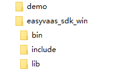
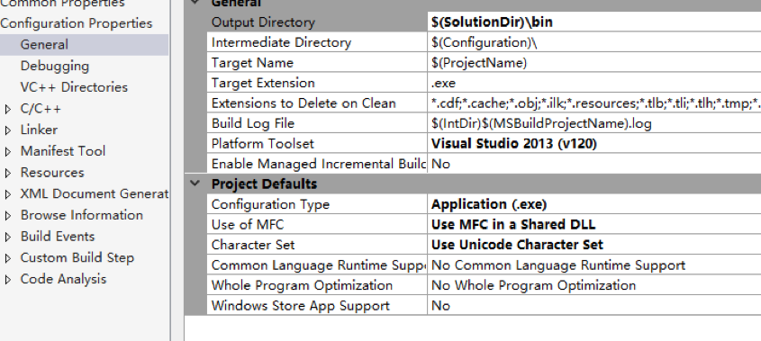

# 快速开始
本节提供快速集成易视云Windows直播端SDK的步骤和示例代码。具体可参考demo中相关代码。

## 直播PC推荐配置
* CPU：intel i5 四系列/E3-1230 v3 物理四核或AMD同等级CPU（intel i5以下配置若直播需要降低分辨率设置）
* 主板：华硕B85系列
* 内存：8G或更多
* 显卡：GTX960 2G显存 或AMD同等级显卡
* 硬盘：500G 或 更多
* 电脑系统为：WIN7及以上(XP系统暂不支持)

## 前置条件
* 已经注册易视云账号，以下文档中统称为APPID
* 申请开通直播权限，获得Access Key和Secret Key，用于鉴权

## 文件目录说明

* demo：easyvaas_sdk_win代码示例
* easyvaas_sdk_win：包含所需要的库。Bin是运行时依赖库，lib是链接依赖库，include包含接口声明和一些自定义结构。

## 环境配置
以demo的环境配置为参考，开发者可以将easyvaas_sdk_win集成到自己的项目中。

* 将easyvaas_sdk_win下的三个文件夹复制到解决方案（.sln）所在的目录；
* 添加include目录

项目附加包含目录中添加include目录，$(SolutionDir)\include。
Configuration -> C/C++ -> Genenral，如下图所示：

* 添加库目录

在项目的附加库目录中添加lib文件所在目录，$(SolutionDir)\lib。也可以在这里配置
  导入的lib库Elive.lib。
  Configuration -> Linker -> All Options，如下图所示：
  
  

或者在代码中添加:
  #pragma comment(lib, “EVLive.lib”)

* exe环境配置

将demo的输出环境配置为$(SolutionDir)\bin。
  Configuration -> General，如下图所示：
  
  

注意：如果想要自己指定输出目录，只需要将bin文件夹下的所有文件复制到自己的输出目录即可。

