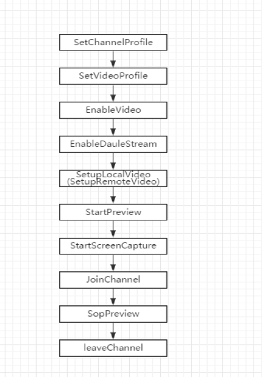

## 连麦
本节主要介绍易视云Windows SDK连麦的基本流程和示例代码。

### 连麦基本流程



### 示例代码
* 通过AfxGetEVLive获取示例调用连麦接口

```
//设置频道模式为直播模式
AfxGetEVLive()->SetChannelProfile(EV_CHANNEL_PROFILE_LIVE_BROADCASTING);

// 设置本地视频属性 640x360   30fps   600kbps，交换宽高
AfxGetEVLive()->SetVideoProfile(EV_VIDEO_PROFILE_360P, true);

// 打开视频模式
AfxGetEVLive()->EnableVideo(true);

// 使用单流模式，默认使用单流模式，可以不设置
AfxGetEVLive()->EnableDauleStream(false);

EVVideoCanvas vc;
vc.uid = 0;  //用户id
vc.view = m_wndLocal.GetSafeHwnd(); //显示视频的窗口

// 如果视频尺寸与显示视窗尺寸不一致，则视频流会按照显示视窗的比例进行周边裁剪或图像拉伸后填满视窗
vc.renderMode = EV_RENDER_MODE_TYPE::EV_RENDER_MODE_HIDDEN;

// 设置本地视频视图
AfxGetEVLive()->SetupLocalVideo(vc);

// 开启本地视频预览
AfxGetEVLive()->StartPreview();

// 开启屏幕共享
AfxGetEVLive()->StartScreenCapture(m_captureWnd);

//进入频道，channelid为双方进入同一频道的标识
AfxGetEVLive()->JoinChannel(channelid, NULL);    
```


